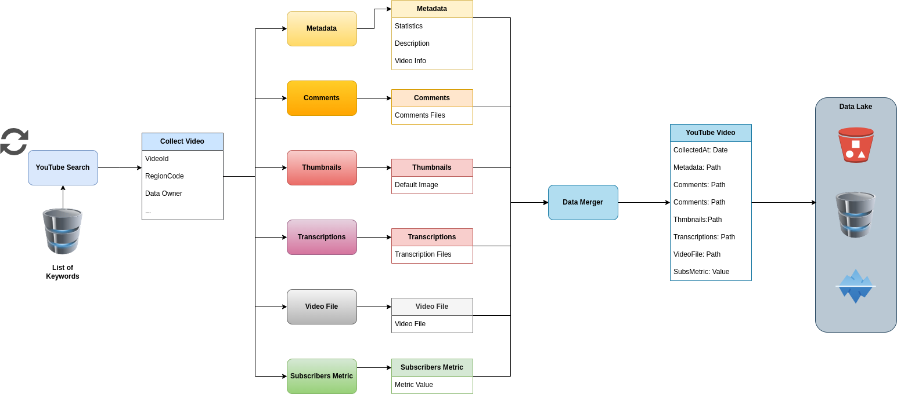

# Scenario

This proof-of-concept software project showcases the acquisition of YouTube comments using a Python script and the YouTube API. The acquired raw data is then passed onto the Apache Pulsar cluster, where it is sorted, processed, and stored with the help of Function Mesh. The processing stage involves sorting the comments into two categories: those containing specific words and those that have received likes. A machine learning algorithm is then employed to analyze the comments and classify them as hate speech. Following this, the video thumbnails and comments are stored in object storage for further analysis.

We aim to create a realistic environment that replicates the process of sorting collected data into categories based on certain parameters. In this case, we sort comments based on specific keywords and relevance. Furthermore, we strive to simulate constant data processing with the help of a machine learning algorithm and the storage of both text and images for future analysis. All the software of this PoC runs inside a Kubernetes cluster using minikube and was implemented in Python. Instructions on how to install the components and the environment are available in the README file.

# Implementation

Figure 1 presents a visual representation of the scenario that will be described. The scenario begins with the comment collector component, which utilizes the Youtube API to search for the top 50 most viewed videos from Italy and extract their comments. The extracted data is then formatted into a JSON object that includes relevant information such as the comment text, user ID, likes, date, replies, video ID, and a UUID key for unification purposes. The JSON data is then sent to the Pulsar cluster using a designated topic.

The first function inside the Pulsar cluster is the dynamic router, which deserializes the incoming data and sorts it into different topics based on the comment text and the number of likes. All comments are sent to a third topic that requires the video thumbnail to be downloaded.

The two topics related to liked comments and keywords are then processed by a machine learning algorithm that simulates the analysis of a hate speech detector. After a certain delay, the data is labelled with the analysis and transmitted through a separate topic. Concurrently, another function mesh receives the messages router through the thumbnail topics and downloads and stores the video thumbnail. The JSON data is updated with the image information and transmitted through a new topic.

The hate speech detector and thumbnail downloader outputs are then received by the unifier function, which organizes the messages by UUID and creates a combined register of the data received. When the same UUID is presented in both the hate speech and downloader outputs, the unifier combines the data and transmits it to a final topic. All received data is then stored in CSV files in Minio via another function mesh function. Finally, outside of the pulsar we have another program in the Kubernetes that consumes the CSV files and produces as output the number of comments that have the label ‘hate speech’.
