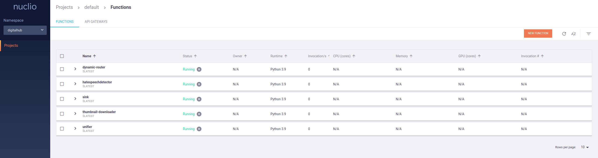

# Apache Pulsar Youtube Comments PoC

This repository contains a series of scripts collect and process Youtube Comments throught Apache Kafka and Nuclio.


# Requirements

## Install Minikube

```bash
curl -LO https://storage.googleapis.com/minikube/releases/latest/minikube-linux-amd64
sudo install minikube-linux-amd64 /usr/local/bin/minikube
```

Start minikube (change 192.168.49.0 if your network setup is different):

```bash
minikube start --cpus=4 --insecure-registry "192.168.49.0/24"
```

Start dashboard:

```bash
minikube dashboard
```

## Install Helm

```bash
curl -fsSL -o get_helm.sh https://raw.githubusercontent.com/helm/helm/main/scripts/get-helm-3
chmod 700 get_helm.sh
./get_helm.sh
```

## Install Kubectl

```bash
curl -LO "https://dl.k8s.io/release/$(curl -L -s https://dl.k8s.io/release/stable.txt)/bin/linux/amd64/kubectl"
sudo install -o root -g root -m 0755 kubectl /usr/local/bin/kubectl

```

## Install DigitalHub Platform

```bash
git clone https://github.com/scc-digitalhub/digitalhub.git
```

Follow the README instructions on the DigitalHub repository.

## Install Strimzi 

```bash
kubectl create namespace kafka

kubectl create -f 'https://strimzi.io/install/latest?namespace=kafka' -n kafka

kubectl apply -f https://strimzi.io/examples/latest/kafka/kafka-persistent-single.yaml -n kafka 

kubectl wait kafka/my-cluster --for=condition=Ready --timeout=300s -n kafka 
```

Test Send and receive messages:

**Sender**:

```bash
kubectl -n kafka run kafka-producer -ti --image=quay.io/strimzi/kafka:0.37.0-kafka-3.5.1 --rm=true --restart=Never -- bin/kafka-console-producer.sh --bootstrap-server my-cluster-kafka-bootstrap:9092 --topic my-topic
```

**Receiver**:
```bash
kubectl -n kafka run kafka-consumer -ti --image=quay.io/strimzi/kafka:0.37.0-kafka-3.5.1 --rm=true --restart=Never -- bin/kafka-console-consumer.sh --bootstrap-server my-cluster-kafka-bootstrap:9092 --topic my-topic --from-beginning
```

## Configure Minio

Login in the Minio Console (http://192.168.49.2:30090/) with the default credentials (`minioadmin:minio123`) and create two buckets:
```
csvbucket
thumbnails
```
Create the access keys, use base64 on the keys (`echo -n 'mykey' | base64`) and update the yaml file:
```
secrets/minio_credentials.yaml
```
Create the secrets:
```bash
kubectl apply -f secrets/minio_credentials.yaml
```

# Running
Go on https://console.cloud.google.com/ create a project and create a Youtube API key and update the yaml file:

```
youtube_collector/youtube_collector.yaml
```

Create the Kafka secret:

```bash
kubectl apply -f secrets/kafka_credentials.yaml
```

Acess the Nuclio dashboard (http://192.168.49.2:30050) and deploy in the default project the yamls files:

```
kafka/dynamic_router/dynamic-router.yaml
kafka/hate_speech_detector/hatespeechdetector.yaml
kafka/sink/sink.yaml
kafka/thumbnail_downloader/thumbnail-downloader.yaml
kafka/unifier/unifier.yaml
```

Your Nuclio dashboard should look like this:



Deploy the Data consumer service

```bash
cd data_consumer
minikube image build -t consumer:latest .
kubectl apply -f data_consumer.yaml
```

Deploy Youtube Collector:

```bash
cd youtube_collector
minikube image build -t collector:latest .
kubectl apply -f youtube_collector.yaml
```

# References
* https://github.com/scc-digitalhub/digitalhub
* https://strimzi.io/quickstarts/
