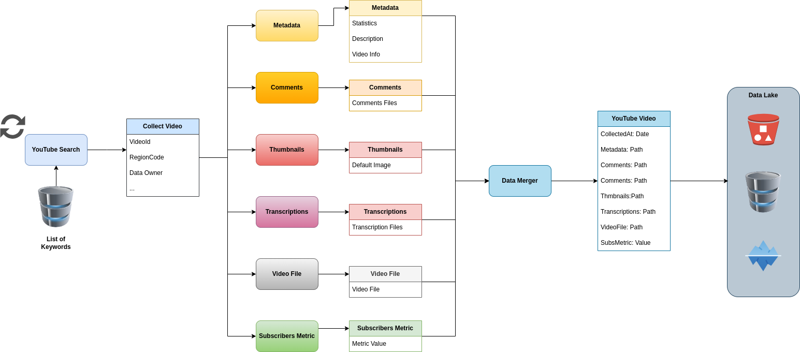

# Apache Pulsar Youtube Comments PoC

This repository contains a series of scripts collect and process Youtube Comments throught Apache Pulsar.



# Requirements

## Install Minikube

```bash
curl -LO https://storage.googleapis.com/minikube/releases/latest/minikube-linux-amd64
sudo install minikube-linux-amd64 /usr/local/bin/minikube
```

Start cluster

```bash
minikube start --memory=8192 --cpus=4 --kubernetes-version=v1.24.1
```

Start dashboard:

```bash
minikube dashboard
```

## Install Helm

```bash
curl -fsSL -o get_helm.sh https://raw.githubusercontent.com/helm/helm/main/scripts/get-helm-3
chmod 700 get_helm.sh
./get_helm.sh
```

## Install Kubectl

```bash
curl -LO "https://dl.k8s.io/release/$(curl -L -s https://dl.k8s.io/release/stable.txt)/bin/linux/amd64/kubectl"
sudo install -o root -g root -m 0755 kubectl /usr/local/bin/kubectl

```

## Install Pulsar Cluster

```bash
helm repo add apache https://pulsar.apache.org/charts
helm repo update
git clone https://github.com/apache/pulsar-helm-chart
cd pulsar-helm-chart
./scripts/pulsar/prepare_helm_release.sh \
    -n pulsar \
    -k pulsar-mini \
    -c
helm install \
    --values examples/values-minikube.yaml \
    --namespace pulsar \
    pulsar-mini apache/pulsar
kubectl get pods -n pulsar
```

To access the pulsar admin:

```bash
kubectl exec -it -n pulsar pulsar-mini-toolset-0 -- /bin/bash
```

To get pulsar proxy address:

```bash
minikube service pulsar-mini-proxy -n pulsar
```

## Install Function Mesh

```bash

helm repo add jetstack https://charts.jetstack.io
helm repo update
helm install \
  cert-manager jetstack/cert-manager \
  --namespace cert-manager \
  --create-namespace \
  --version v1.8.0 \
  --set installCRDs=true

helm repo add function-mesh http://charts.functionmesh.io/
helm repo update
export FUNCTION_MESH_RELEASE_NAME=function-mesh
export FUNCTION_MESH_RELEASE_NAMESPACE=function-mesh
kubectl create namespace function-mesh
helm install ${FUNCTION_MESH_RELEASE_NAME} function-mesh/function-mesh-operator -n ${FUNCTION_MESH_RELEASE_NAMESPACE}
```
Check if it's installed:
```bash
kubectl get pods -n ${FUNCTION_MESH_RELEASE_NAMESPACE} -l app.kubernetes.io/instance=function-mesh
```

You should get the following output:
```bash
NAME                                               READY   STATUS    RESTARTS   AGE
function-mesh-controller-manager-5f867557c-d6vf4   1/1     Running   0          8s
```

## Install Minio

```
kubectl apply -f mini-dev.yaml
```

Start port foward:

```bash
kubectl port-forward pod/minio 9000 9090
```

Login in the Minio Console (http://localhost:9000) with the default credentials (`minioadmin:minioadmin`) and create two buckets:
```
csvbucket
thumbnails
```
Create the access keys on minio and update the following yaml files:
```
thumbnaildownloader/thumbnaildownloader.yaml
data_consumer/data_consumer.yaml
pulsar-sink/cloud-sink.yaml
```

# Running
Go on https://console.cloud.google.com/ create a project and create a Youtube API key and update the yaml file:

```
youtube_collector/youtube_collector.yaml
```
After the installation of the requirements simply deploy with the script:

```bash
bash build_and_deploy.sh
```

# References
* https://pulsar.apache.org/docs/3.0.x/kubernetes-helm/
* https://functionmesh.io/docs/install-function-mesh/
